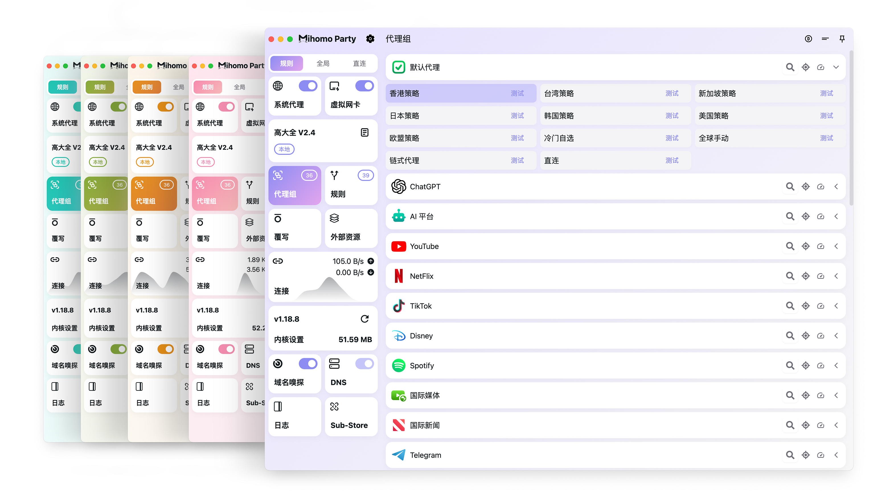

<h3 align="center">
  
  
</h3>

<h3 align="center">Another <a href="https://github.com/MetaCubeX/mihomo">Mihomo</a> GUI · LAN Direct-Access Rebuild</h3>

<p align="center">
  <a href="https://github.com/Swipa5fox/Clash-Party-Web-pvs/releases">
    
  </a>
  <a href="https://github.com/Swipa5fox/Clash-Party-Web-pvs">
    
  </a>
  <a href="./LICENSE">
    
  </a>
</p>
<div align='center'>

</div>

基于 [Clash Party](https://github.com/mihomo-party-org/mihomo-party)（Mihomo / Clash Meta 的 Electron 图形客户端，fork 自 v2.0.2）重建的**内网自用版本**：把桌面客户端装进容器，用浏览器访问与桌面端一致的完整界面，由网关统一承担机场插件与面板反代。

> ⚠️ 本项目面向**可信内网**自用：为支持内网直连，移除了传输加密、SSRF 防护与设备签名，凭据改为明文落盘。**不要暴露到公网，也不要对外分发。**

## 当前版本 v1.1（2026-09-24）

自 v1.0 以来的核心更新（详见 [changelog.md](./changelog.md)）：

- **配置热重载异步化**：保存订阅 / 覆写 / DNS / 嗅探器后不再被秒级重载卡住，失败才提示
- **代理组递归解析**：嵌套子组可展开（3 层深度上限），修复子组展不开与页面卡死
- **依赖精简**：移除 pubsub-js / nanoid，改用原生 `CustomEvent` 与 `crypto.randomUUID`
- **修复**：v1.1 原提交误删 package.json `dependencies` 块导致源码构建失败，已恢复
- 安装包见 [GitHub Release v1.1.0](https://github.com/Swipa5fox/Clash-Party-Web-pvs/releases/tag/v1.1.0)（仅 Windows x64）

完整分类清单见 [changelog.md](./changelog.md) 与 [GitHub Release](https://github.com/Swipa5fox/Clash-Party-Web-pvs/releases)。

## 重要功能

### 桌面端能力（继承上游）

- 开箱即用、无需服务模式的 TUN
- Smart Core 规则覆写，基于 AI 模型自动选择最优节点（详见 [官方文档](https://clashparty.org/docs/guide/smart-core)）
- 订阅管理、节点选择、连接与日志、DNS/嗅探配置
- 覆写系统：任意修订配置文件，支持 JS 脚本与 YAML 补丁、age 加密、Smart 覆写独立时序
- WebDAV 备份恢复、多种配色主题、多语言（简中 / 繁中 / 英）

### 重建版新增

- **Web UI 模式**：以 `--web`（或 `CP_WEB_MODE=1`）headless 启动，浏览器打开即用完整 React 界面，token 鉴权；内核、订阅定时更新照常运行
- **`cpx-party` 容器**：官方 Web 模式进 Docker（Electron + 运行库 + xvfb + 自带 mihomo 内核与 geo 资源），订阅/覆写/主题全部在浏览器管理，数据落命名卷、重建不丢
- **`cpx-gateway` 网关**：机场插件 v2 服务端（发现 / 登录 / 领取订阅 / 撤销）+ 单端口面板反代（zashboard 与 mihomo REST/WebSocket），零第三方依赖
- **一键部署**：`./deploy.sh` 六阶段流水线（预检 → 配置 → 构建 → 推送 → 启动 → 健康检查），首次运行自动生成 `CP_WEB_TOKEN`；`deploy/opt/bootstrap.sh` 覆盖 `/opt` 从零构筑全流程
- **国家双口线路**（`tools/mihomo-lines`）：每国一对端口（通用分流口 + 全局口），AU/JP 预置，纯 YAML 覆写 + `include-all`/`filter` 正则自适应机场节点；经 WS 桥远程下发，全程无需 ssh
- **自定义线路组**：在界面上为「选定节点集合 + 专属端口」生成代理组与监听端口，子组支持 url-test / fallback / select 独立开关，无需手写覆写
- **离线内核构建**：`deploy.sh` 自动把 `/opt/cpx-core-assets` 预置资源同步进构建上下文，构建不再依赖 github.com 可达性，换网络环境不重下 238MB
- **容器部署感知**：容器内点击系统代理 / TUN 时给出可操作提示（引导设备手动配置代理口），而非抛出底层错误
- **发布链路本地化**：自动更新 / 更新说明 / Telegram 通知全部指向本仓库，不再被上游版本覆盖；移除内嵌 Sub-Store（容器场景不可用且拖慢构建）

## 技术栈

| 层           | 选型                                                                        |
| ------------ | --------------------------------------------------------------------------- |
| 运行时       | Electron 43（主进程 / 预加载 / 渲染层三进程模型）                           |
| 内核         | mihomo（Clash Meta）、mihomo-alpha、mihomo-smart 三个 sidecar 可切换        |
| 语言         | TypeScript 5.9                                                              |
| 界面         | React 19 + HeroUI + Tailwind CSS 4，配 react-virtuoso、Monaco、d3、chart.js |
| 状态与国际化 | SWR、i18next / react-i18next                                                |
| 构建         | electron-vite 4（Vite 7）+ electron-builder，渲染层单入口 `web`             |
| 主进程与桥接 | Node 22、express（Web 模式静态服务）、ws（RPC 桥）                          |
| 网关         | Node ≥ 22.5，零第三方依赖，使用内置 `node:sqlite`                           |
| 容器         | Docker + Compose v2，多阶段构建，依赖默认走 npmmirror                       |
| 质量保障     | vitest（单元 / 集成）、eslint + prettier、tsc 类型检查                      |

## 实现方式

### 主进程与通信

- `src/main`：内核启停与配置生成、订阅更新、覆写执行，IPC handler 集中在单一字典中注册
- `src/renderer`：React 应用，统一通过 `window.electron.ipcRenderer` 调用全部能力

### Web 模式：WebSocket RPC 桥

浏览器中没有 Electron IPC，因此 Web 端以「同形状 shim + 服务端桥」对齐桌面端：

- 主进程用 express 托管 `out/renderer/web.html` 静态资源，并在同端口（默认 `:3999`）挂 WebSocket
- `src/renderer/src/web/main-web.ts` 在浏览器实现 `window.electron`：invoke 发 `{type:'invoke', id, channel, args}`，结果按 id 回填；事件按 `{type:'event', channel, payload}` 广播
- 服务端复用主进程同一份 handler 字典（约 150 个 invoke channel），因此 Web 端与桌面端功能对齐
- 桌面专属能力（杀进程、宿主弹窗、路径暴露等 20 余个 channel）在 Web 模式统一拒绝；本地文件读写类能力改由「内容直传」通道替代（备份 base64、主题内容导入等）
- token 经 URL `?token=` 进入后写入 sessionStorage 并从地址栏清除；无效或过期以 4001 关闭码进入终端提示态

### 容器部署拓扑

```text
LAN 浏览器 ──:3999──►┌────────────────────────────────────────┐
                    │ party 容器（Clash Party --web 模式）     │
                    │  ├─ out/renderer/web.html + WS RPC 桥   │
                    │  └─ 自带 mihomo 内核（sidecar 子进程）   │
                    │       ├─ :7890 混合代理（HTTP+SOCKS5）   │
                    │       └─ :9090 控制器（仅 compose 内网） │
                    └───────────────┬────────────────────────┘
                                    │ 反代 panel / REST / WS
LAN 客户端 ────:8080──►┌───────────▼────────────────┐
                    │ gateway 容器（cpx-gateway）│
                    │  ├─ 机场插件 v2 API        │
                    │  └─ 面板与 mihomo API 反代 │
                    └────────────────────────────┘
LAN 设备 ─────:7890───► party 内核（HTTP + SOCKS5 共享代理）
```

### 配置生成流水线

`generateProfile()`（`src/main/core/factory.ts`）按固定次序合成最终配置：

1. 载入基础订阅配置
2. 应用普通覆写（JS 脚本 / YAML 补丁，YAML 支持 age 解密）
3. 应用规则覆写（prepend / append / delete，支持偏移量）
4. 应用 Smart 覆写
5. 与受控配置 deepMerge（DNS、嗅探、局域网开关等由应用统一管理）
6. **注入自定义线路组**
7. Smart 模式下排除代理服务器 IP 的 TUN 路由（防回环）
8. 原子写盘，并按需更新运行时配置缓存

自定义线路组的注入（`applyCustomLineGroups`）：每个线路组生成一个入口组，其成员为启用的子组（`url-test` 自动 / `fallback` 故障 / `select` 手动，可单独开关），每个子组挂载所选节点集合；同时创建名为 `<组名>·入口` 的 `mixed` 监听端口。组名冲突时跳过，同名监听端口则覆盖更新。

### 机场插件 v2（网关侧）

- **首次登录**：客户端请求发现文件 `/.well-known/cpx-gateway` → 系统浏览器打开 `/oauth/authorize` 输入账密 → 网关签发一次性 `code`（绑定 PKCE / redirect_uri / client_id，TTL 60s）→ `/enroll` 提交 code + verifier + deviceId 完成设备绑定
- **订阅更新与撤销**：`/challenge` 领取一次性 nonce，`/config`（或 `/revoke`）回执 nonce 防重放；隐藏订阅 URL 仅网关侧持有，按账号配额与设备数校验
- 密码只保存 scrypt hash，登录按 IP 限流；code 与 nonce 均为一次性短 TTL

### 构建与资源

- 主进程 / 预加载 / 渲染层由 electron-vite 统一构建，产物落 `out/`
- 内核与 geo 资源由 `scripts/prepare.mjs` 获取；容器构建改由服务器侧 `/opt/cpx-core-assets` 预置（`deploy.sh` 同步进构建上下文），构建过程不依赖 GitHub
- `deploy/opt/bootstrap.sh` 用于新机器一键构筑：解压源码 → 预检（docker / 外网）→ 写 `.env` 与线路端口映射 → 调用 `deploy.sh` 构建启动 → 输出访问入口

## 目录结构

```text
src/
  main/         主进程：内核管理、配置生成与覆写、订阅、IPC handler 字典
  preload/      预加载：channel 白名单与 window.electron 暴露面
  renderer/     React 界面（index / floating / web 三入口）
  shared/       主进程与渲染层共用的类型、i18n 资源
deploy/
  aur/          AUR 打包定义（PKGBUILD ×5，CI tag 发布时更新）
  build/        electron-builder 打包资源（图标、安装器脚本、entitlements）
  gateway/      cpx-gateway：机场插件网关 + 面板反代（零依赖 Node）
  party/        cpx-party：Clash Party Web 容器（Dockerfile + entrypoint）
  opt/          bootstrap.sh 新机器构筑脚本、订阅备份脚本
docs/plugin/    机场服务端对接指南（v2）
tools/          mihomo-lines：国家双口线路管理（YAML 覆写 + WS 桥下发）
scripts/        构建期资源准备与打包脚本
```

## 快速开始

### 桌面端

```bash
pnpm install
pnpm run dev          # 开发（Web 模式，浏览器访问 :3999）
pnpm run build:win    # 打包（另有 build:mac / build:linux）
```

### 容器部署（内网推荐）

```bash
cd deploy/gateway
./deploy.sh           # 构建 gateway + party 并启动，结束后打印带 token 的 Web UI 地址
```

无源码的新机器可用 `deploy/opt/bootstrap.sh`（用法见脚本头部注释）。完整选项、运维命令、账号管理与 FAQ 见 [`deploy/gateway/README.md`](deploy/gateway/README.md)。

| 端口   | 用途                                                                             |
| ------ | -------------------------------------------------------------------------------- |
| `8080` | 网关：机场插件 API + 面板与控制器反代                                            |
| `3999` | Clash Party Web UI（token 鉴权）                                                 |
| `7890` | 局域网共享代理（HTTP + SOCKS5 混合口）                                           |
| 任意   | 自定义线路组端口：Web UI 即写即生效（host 网络模式直接绑宿主机，仅需放行防火墙） |

## 文档

- 官方使用文档：<https://clashparty.org>
- 容器部署与运维：[`deploy/gateway/README.md`](deploy/gateway/README.md)
- 机场服务端对接：[`docs/plugin/机场服务端对接指南-v2.md`](docs/plugin/机场服务端对接指南-v2.md)
- 版本变更记录：[`changelog.md`](changelog.md)

## 安全边界

本重建版为内网直连做了以下简化，**仅适合可信内网自用**：

- 客户端与网关允许纯 HTTP 与内网 host，不强制 HTTPS，也不拦截私网地址（便于订阅源放内网）
- 移除 Ed25519 设备签名，防重放改由一次性 nonce 承担
- vault 明文 JSON 落盘，不再使用系统 Keychain / safeStorage 加密
- Web UI 由单枚 `CP_WEB_TOKEN` 鉴权，拿到即等同完全控制该实例，请勿外泄；mihomo 控制器仅绑 `127.0.0.1`，面板与控制 API 经网关反代并由 `PANEL_TOKEN` 门禁（默认与 `CP_WEB_TOKEN` 同值）

## 许可证与致谢

- 本项目基于 [Clash Party](https://github.com/mihomo-party-org/mihomo-party) v2.0.2 重建，遵循 [GPL-3.0](LICENSE)
- 内核：[mihomo](https://github.com/MetaCubeX/mihomo)（Clash Meta）
- 面板：[zashboard](https://github.com/Zephyruso/zashboard)
